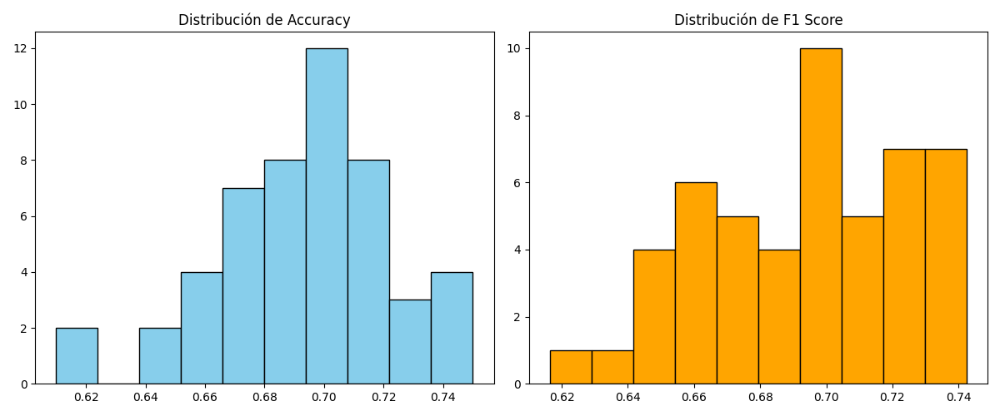
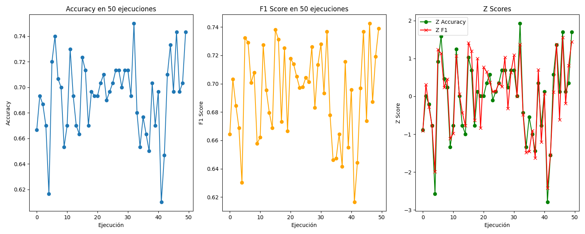

# Árbol de decisión CART aplicado al dataset de spam

**Presentado por:**  
- Christian Barreto  
- Juan Barbosa Avella  

---

## 1. Procedimiento realizado
El presente trabajo tuvo como objetivo implementar un sistema de clasificación de correos electrónicos (**SPAM o HAM**) utilizando un árbol de decisión con el algoritmo **CART (Classification and Regression Trees)**.

El procedimiento consistió en:

- Cargar el dataset [dataset_spam.csv](data/dataset_spam.csv), que contiene características representativas de correos electrónicos (longitud del correo, número de enlaces, cantidad de signos de exclamación, etc.).  
- Definir un conjunto de características (**X**) y la etiqueta (**y**) correspondiente, que indica si el correo es SPAM o HAM.  
- Entrenar un modelo de árbol de decisión (**CART**) en múltiples ejecuciones (50 repeticiones), utilizando particiones aleatorias de entrenamiento y prueba (70% - 30%).  
- Calcular las métricas de desempeño **Accuracy** (exactitud) y **F1 Score** (equilibrio entre precisión y recall) en cada ejecución.  
- Analizar estadísticamente los resultados mediante:  
  - Promedios y desviaciones estándar  
  - Cálculo de **Z-Score** para detectar valores atípicos (outliers).  
- Representar gráficamente la distribución y variación de los resultados, con el fin de visualizar la estabilidad del modelo.  
- Guardar los resultados obtenidos en un archivo CSV llamado [resultados_spam.csv](results/resultados_spam.csv) para su posterior análisis.

---

## 2. Librerías utilizadas

- **pandas**: utilizada para la carga, manipulación y análisis de datos en formato tabular.  
- **numpy**: empleada para cálculos numéricos, promedios y desviaciones estándar de las métricas.  
- **matplotlib.pyplot**: utilizada para la generación de gráficos (series temporales e histogramas).  
- **scikit-learn (sklearn)**:  
  - `train_test_split`: divide los datos en conjuntos de entrenamiento y prueba.  
  - `DecisionTreeClassifier`: implementa el modelo de árbol de decisión con el criterio CART (*gini*).  
  - `accuracy_score` y `f1_score`: métricas de evaluación del modelo.  
- **scipy.stats (stats.zscore)**: utilizada para estandarizar resultados mediante **Z-Score** y detectar valores atípicos.  

---

## 3. Gráficas obtenidas

### 📊 Histogramas de Accuracy y F1 Score
- Muestran la distribución de los valores obtenidos en las 50 ejecuciones.  
- Se observa que la mayoría de los resultados se concentran alrededor de **0.70**, indicando estabilidad en el rendimiento del modelo.

 

### 📈 Series de resultados en 50 ejecuciones
- Accuracy y F1 Score se graficaron por ejecución.  
- Evidencian oscilaciones entre **0.61 y 0.75**, sin una tendencia definida.  
- Esto refleja variaciones naturales por la partición aleatoria de los datos.  

### 🔎 Gráfico de Z-Scores
- Representa los valores estandarizados de Accuracy y F1 Score.  
- La mayoría de los puntos están entre **-1 y +1**, lo que indica normalidad.  
- Algunos casos extremos alcanzan valores cercanos a **±2**, identificados como ejecuciones atípicas (*outliers*).

---

## 4. Explicación de los resultados

El modelo de **árbol de decisión CART** alcanzó un rendimiento promedio cercano al **70%** tanto en Accuracy como en F1 Score, lo que indica un desempeño **aceptable y relativamente estable**.  

Los resultados se distribuyen en un rango moderadamente estrecho, lo cual sugiere que el modelo es consistente, aunque no perfecto.  

El hecho de que el **F1 Score** se mantenga cercano al Accuracy confirma que el clasificador logra un **equilibrio razonable** entre:  
- Minimizar los falsos positivos (correos legítimos clasificados como SPAM).  
- Minimizar los falsos negativos (correos SPAM clasificados como HAM).  

Los análisis con **Z-Score** muestran que la mayoría de las ejecuciones se concentran en la zona normal (±1), con pocas ejecuciones atípicas que presentan rendimientos significativamente mejores o peores.  

En general, el modelo muestra un comportamiento confiable, aunque no siempre alcanza la misma precisión debido a los cambios en la división de los datos.
